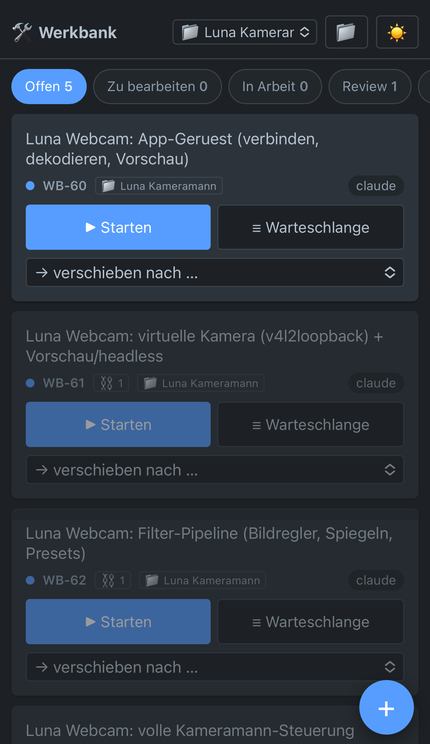
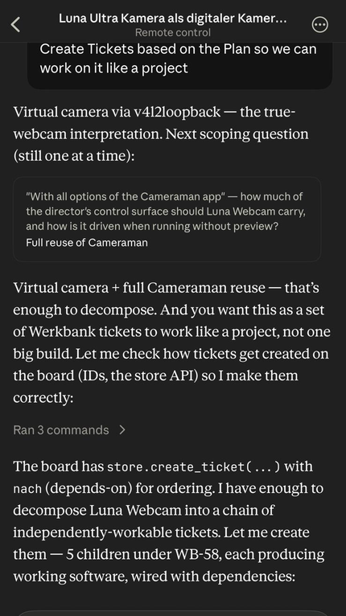

# Werkbank

A Jira-like ticket board for [Claude Code](https://claude.com/claude-code) agents —
built entirely by talking to Claude Code, for a non-technical owner, in two days.

You (or an agent) write tickets. You drag a ticket to **In Arbeit** — and a Claude
agent picks it up, works it in the target project, and reports back into the
ticket for your review. If the remembered worker is a live chat conversation, the
ticket is handed over there and worked **visibly in front of you**.

> ⚠️ **A ticket is an executable prompt.** Moving one to *In Arbeit* runs
> `claude -p` in your project with `Bash` pre-approved — anyone who can create
> and drag a ticket can run commands as you. Localhost-only by default; read
> the [Security](#security) section before you expose the board or hand it to
> anyone else.

**Quick start** (needs Python 3.10+, a logged-in `claude`, ~5 minutes):

```bash
git clone https://github.com/edrethardo/werkbank-board.git werkbank
cd werkbank && cp config.example.json config.json  # edit default_project
python3 src/werkbank/server.py                     # then open http://127.0.0.1:8765
```

The UI is in German — all buttons, dialogs and error messages, `<html
lang="de">`. Docs and the changelog are German too; code, commits and
developer docs are English. Details in [Language](#language) below.

<p align="center">
  
  <br>
  <em>Das Board auf dem Handy — Status antippen, Ticket starten, fertig.
  Am Rechner sind es sieben Spalten zum Ziehen.</em>
</p>

## What it does

- **Kanban board with a self-driving queue.** Seven columns Offen → Zu bearbeiten
  → In Arbeit → Rückfrage → Review → Fehlgeschlagen → Erledigt, drag & drop; tickets
  parked in *Zu bearbeiten* start themselves one after another. Ticket links
  express order and mutual exclusion.
- **Drag to dispatch.** Moving a ticket to *In Arbeit* spawns a headless
  `claude -p` run in the ticket's target project, resuming that project's
  remembered ticket session — or handing the ticket to your live chat, when
  the last worker was one, for visible work in front of you.
- **Honest runtime picture.** Running cards show steps, last tool, tokens
  and the CLI's own quota reading; a silent run is flagged; failures land
  in a separate *Fehlgeschlagen* column with the plain-language reason
  ("usage limit reached"), not an error code.
- **Tickets are plain markdown files** in `tickets/` — the files are the
  source of truth. Git them if you want history; the server never **commits**
  anything — only the ticket-working skills do. (The `opencode` worker does
  run read-only `git diff` / `rev-parse` to show a reviewer what changed.)
- **A second, local worker (optional, and it needs setup you must supply).**
  A ticket with `assignee: opencode` is worked by a model on your own machine
  instead of Claude, and is accepted only when a CHECK you configured passes —
  a local model reports success over failing tests, so its own summary must
  never be the acceptance criterion. The ticket names the check; the command
  behind that name lives in `config.json` under `gates`, so nothing that
  crosses the network is ever executed. No check, no dispatch.

  **It is not entirely free.** After a green check the board runs one paid
  Claude review over the diff (a few cents), because a local model's own
  "done" is not evidence. Put `review: nein` in the ticket to skip it.

  It shells out to a launcher called `opencode-task` (`<project dir>` as
  argv[1], the task on stdin, the final text on stdout, exit 4 = endpoint
  unreachable). `assignee: dsh` is the same lane through a second harness and
  answers the SAME contract, so the board has one code path for both — see
  [`examples/dsh-task`](examples/dsh-task). Both share one slot, because they
  share one GPU. A working reference implementation ships in
  [`examples/opencode-task`](examples/opencode-task) — copy it onto your
  `PATH` and point it at your own agent, or replace it entirely; the board
  only cares about that contract, and
  [`tests/test_examples.py`](tests/test_examples.py) pins it. If no launcher
  is on the `PATH`, such a ticket fails with a message saying exactly that and
  everything else on the board keeps working. Walkthrough:
  [`docs/user/opencode-beispiel.md`](docs/user/opencode-beispiel.md);
  reasoning: [`docs/dev/opencode-gate-dispatch.md`](docs/dev/opencode-gate-dispatch.md).

More on architecture, hardening, and the small-scale trade-offs behind these
choices in [`docs/dev/board-internals.md`](docs/dev/board-internals.md).

(The tool keeps a work journal under `docs/journal/` — the skills write one
entry per session. What is in this repo is a **sample**: the entries from the
run-up to 1.0, kept as an example of what that habit produces. It is not
updated further; yours grows from here.)

## Getting it running

### Requirements

- **Claude Code**, installed and logged in — `claude --version` must work in a
  terminal, and `claude -p "hi"` must answer. The board shells out to that
  binary; agent runs consume your Claude quota.
- **Python 3.10+** (standard library only, nothing to install).
- **Linux, macOS or Windows.** File locking uses `fcntl` on Unix and `msvcrt`
  on Windows; ticket files always use `\n` line endings, whatever the platform.
  The unit suite **passes** on ubuntu-latest, windows-latest AND macos-latest
  on every push (`.github/workflows/tests.yml`): 580 tests here. A number of
  them skip themselves on Windows and macOS — process groups, signals,
  `/proc`, symlinked credentials — each printing its reason in the log, never
  silently. (Honest caveat: the
  maintainer has no Windows machine. **Nobody has ever STARTED the board on
  Windows or macOS** — CI runs the unit suite there, which is not the same
  thing. What CI does not exercise at all — the
  chat-handover watcher and the local-model check (`opencode` and `dsh`), all
  shell-based — is
  unproven there, and stated as such below. Reports welcome.)
- **git**, if you want the ticket history that this design assumes.

### 1. Get the code and configure it

```bash
git clone https://github.com/edrethardo/werkbank-board.git werkbank
cd werkbank
cp config.example.json config.json
```

Edit `config.json`: set `default_project` to the absolute path of the project
your tickets are about, and list your projects under `projects` (name → path).
You can also do this later in the board's **📁 Projekte** dialog, which has a
folder picker. `config.json` is gitignored — it is yours, not the repo's.

**Shortcut for the same setup:** open the Werkbank folder in Claude Code (see
step 4) and type `init` — the chat asks you the same questions, writes
`config.json` for you and offers to install the pull-ticket skill. It is
strictly optional; both paths end in the same file.

### 2. Start the board

```bash
python3 src/werkbank/server.py               # Linux, macOS
py -3 src\werkbank\server.py                 # Windows (or `python`)
```

Open <http://127.0.0.1:8765>. That is the whole installation — one process, no
database, no build step. Stop it with Ctrl-C.

**Platform notes.** File locking, log paths and line endings are cross-platform
(unit-covered, exercised by CI on Linux and Windows). Three things are
Unix-only:

- The **chat-handover watcher** in the `werkbank-pull-ticket` skill is a
  `bash` loop — on Windows the fallback background run kicks in instead
  after `chat_handover_minutes`.
- The **check behind an `opencode` ticket** runs via `/bin/sh -c`, so that
  worker cannot verify its work on Windows. Claude tickets are unaffected.
- The **systemd** autostart in §6 is Linux-only; macOS uses `launchd`,
  Windows uses the Startup folder (see §6).

### 3. Create a ticket and let an agent work it

1. **+ Neues Ticket** — title, description, target project, priority.
2. Drag it from **Offen** to **In Arbeit**.
3. The board starts `claude -p` in that project's directory and writes what it
   is doing onto the card (steps, last tool, tokens, quota).
4. When the agent is done, its honest summary lands in the ticket's *Ergebnis*
   and the card moves to **Review** — failures included, with the reason.
5. You press **Annehmen** (→ Erledigt) or **Ablehnen** with a reason (→ back to
   Offen, your reason recorded in the ticket).

Nothing starts that you did not put there: an agent runs because you dragged
a ticket, queued it, or asked for it in chat. But once a ticket sits in **Zu
bearbeiten**, the board works the queue on its own — including right after a
reboot, with no browser open and nobody watching. That is deliberate (it used
to require an open tab, which meant tickets silently never started), and it is
the reason the board must not be reachable by anyone you would not hand a
shell to.

### 4. Talk to it from Claude Code (optional but this is the point)

<p align="center">
  
  <br>
  <em>Aus einem Plan werden Tickets: der Agent legt sie selbst über die Werkbank
  an — samt Abhängigkeiten — und arbeitet sie danach einzeln ab.</em>
</p>


Open the Werkbank folder in Claude Code. The repo ships project skills in
`.claude/skills/`, so you can say things like:

- *"Erstelle ein Ticket für …"* — the session drafts and files it properly.
- *"Arbeite die Tickets ab"* / *"erledige WB-7"* — works tickets in the chat,
  visibly.
- *"Starte das Board"* — starts/restarts the server and verifies it answers.

To let **other projects'** Claude sessions pull their own tickets, install the
two user-level skills once:

```bash
mkdir -p ~/.claude/skills
cp -r .claude/skills/_user-level/werkbank-pull-ticket ~/.claude/skills/
cp -r .claude/skills/_user-level/werkbank-report-bug  ~/.claude/skills/
```

Each skill sets the Werkbank path in a `WERKBANK=…` line at the top of every
command block it contains — five of them in `werkbank-pull-ticket`. Adapt
**all** occurrences to wherever you cloned Werkbank (a find-and-replace of the
path over the file does it); the path is never hidden inside Python code, only
ever in that shell assignment.
In any project session you can now say *"zieh dir dein Ticket"* or *"ich hab
einen Bug gefunden"*.

### 5. Use it from your phone (optional)

The board can serve your home network, protected by a password. **The commands:**

```bash
python3 src/werkbank/server.py --set-password   # asks twice, stores only a hash
python3 src/werkbank/server.py --lan-on         # prints the address for your phone
systemctl --user restart werkbank-board         # (or restart it however you run it)
```

Open the printed address (something like `http://192.168.1.42:8765`) on the
phone, enter the password once — it stays logged in for 30 days. `--lan-off`
puts everything back to localhost.

**Understand what you are enabling.** The password is the only thing between
your network and a shell on this machine: anyone who has it can start a ticket,
and a ticket runs `claude -p` with Bash pre-approved. The traffic is plain HTTP,
so a hostile Wi-Fi can read the password on first login. Do not do this on
public or shared networks; for anything beyond your own home, use an encrypted
tunnel (Tailscale, WireGuard, SSH) and leave the board on localhost.

### 6. Start it automatically (optional)

**Linux (systemd)** — `~/.config/systemd/user/werkbank-board.service`:

```ini
[Unit]
Description=Werkbank Board

[Service]
ExecStart=/usr/bin/python3 %h/code/werkbank/src/werkbank/server.py
WorkingDirectory=%h/code/werkbank
Restart=always
RestartSec=3

[Install]
WantedBy=default.target
```

```bash
systemctl --user daemon-reload
systemctl --user enable --now werkbank-board
```

The board then starts at login and restarts itself after a crash. Logs:
`journalctl --user -u werkbank-board`; agent run logs live in
`~/.local/state/werkbank/logs/`.

**macOS** — the same effect with a `launchd` plist in
`~/Library/LaunchAgents/`, or simply keep a terminal running.

**Windows** — press `Win+R`, type `shell:startup`, and put a shortcut there to:

```
pythonw.exe C:\Pfad\zu\werkbank\src\werkbank\server.py
```

`pythonw.exe` starts it without a console window. Agent run logs then live in
`%LOCALAPPDATA%\werkbank\logs\`.

### Configuration reference

| Key | Meaning |
|---|---|
| `port` | TCP port to listen on (default 8765). |
| `host`, `lan`, `password_hash` | Interface, network mode and login hash — **do not edit by hand**. Use `--lan-on` / `--lan-off` / `--set-password` (see §5): they set the three together. Editing them by hand cannot silently expose the board, but it can stop it from starting: a non-local `host` without LAN mode, or LAN mode without a password, makes the board **refuse to start** and say why. The other direction — `lan: true` with a local `host` — starts normally and says at startup that the network mode is having no effect. |
| `assignee_router` | Word lists per assignee (`{"claude": ["security", …], "opencode": ["test", …]}`). The new-ticket dialog suggests an assignee when the title matches — a suggestion, never a decision; you can always override it. |
| `chat_claim_minutes` | How long a chat session's claim on a ticket protects it from the board's orphan sweep (default 60). |
| `gates` | Per project: named checks an `opencode` ticket may pick, `{"<project path>": {"<name>": "<command>"}}`. The command lives here and nowhere else — a ticket only ever names one. |
| `claude_bin` | Full path to the `claude` executable, if it is not on the board's `PATH` (a systemd service often has a different one). |
| `default_project` | Target project for new tickets that name none. |
| `projects` | Named project list (name → absolute path) shown in the dialogs. |
| `agent_permission_mode` | Permission mode for dispatched runs (default `acceptEdits`). |
| `agent_allowed_tools` | Extra allowed tools for dispatched runs (default `Bash`). |
| `agent_timeout_minutes` | Hard limit per a claude run (default 30). |
| `opencode_timeout_minutes` | Hard limit per a LOCAL run — `opencode` and `dsh` (default 60). Local models are slower; this is deliberately not the same number. |
| `chat_claim_warn_minutes` | After how many minutes a standing chat-session claim is called out on the card as "no result yet" (default 10). |
| `chat_handover_minutes` | How long a live chat session may claim a handed-over ticket before a background run takes over (default 5). |
| `nonblocking_review` | Per project: may the queue continue while a ticket waits in Review? |

### Tests

```bash
python3 -m unittest discover -s tests -v
```

580 tests at the 1.1.0 tag, no dependencies, no network access needed. A handful skip
themselves on Windows and macOS (they use shell-script stand-ins for the CLI) —
CI prints those skips in the log so they don't go silently green.

## How it's built

Python 3 standard library only, one `http.server` process, one static HTML
page. See `docs/dev/stack.md` for the reasoning, and `docs/dev/` for the
decision records behind the bigger pieces. `docs/journal/` holds a sample of
the build history as it was written down at the time — every feature, every bug,
every wrong turn, including a security review that found a CSRF→RCE chain in
this very tool. Those entries stop at the 1.0 development; later ones stay
private. They are there to show what the journal habit is worth, not as
reference documentation.

## Security

**A ticket is an executable prompt.** Dragging a ticket to *In Arbeit* runs
`claude -p` in the ticket's target directory with `--permission-mode
acceptEdits --allowedTools Bash` (the shipped defaults) and no human in the
loop. Anything that can create a ticket and move it can therefore run commands
as you.

That is fine for its actual purpose — one person, one machine — and the board
is built around that assumption:

- It binds to `127.0.0.1` only. The LAN mode (§5) is the ONLY way to open it
  up, and it requires a password. That rule is enforced where the socket is
  opened, not just in the helper: a `config.json` with a non-local `host` but
  no LAN mode, or LAN mode without a password, makes the board **refuse to
  start** and print why. Do not rely on the Host-header guard for this — it
  stops browsers, not somebody with `curl`.
- **Lost your phone? Change the password.** `--set-password` rotates the
  session-signing secret, so every device that was logged in is logged out at
  once — a 30-day cookie on a device you no longer have stops working
  immediately.
- Writes must carry an `application/json` content type, and a `Host` that
  names the board — a bare hostname is refused, which is what stops DNS
  rebinding. An `Origin` header, when the browser sends one, must match. Two
  deliberate gaps, so that `curl` and the skills keep working: a request with
  NO `Host` and a request with NO `Origin` are both accepted. Browsers always
  send `Host` and send `Origin` on cross-site writes, so the CSRF path stays
  closed; a local script can still talk to the board, and anything that can
  reach the board can start an agent.
- The page never renders ticket data as HTML, ticket fields cannot smuggle
  extra frontmatter, and agent logs are written to a private `0700`
  directory. The folder *picker* only offers your home directory and
  registered projects — that is convenience, not containment: a ticket's
  `project` may name any absolute path, and anyone who can set it can already
  start an agent.
- Publishing a Werkbank checkout publishes `tickets/` — the live board,
  including future tickets. Fork the code, not the board, if you don't want
  that.

If you hand the board to anyone else, or point it at content you did not
write, treat that as granting shell access and tighten
`agent_permission_mode` / `agent_allowed_tools` first. The findings behind
these measures came out of a dedicated security review; the measures
themselves are the list above and the tests in `tests/test_security.py`.

## Language

The UI, user manual (`docs/user/`), [CHANGELOG](CHANGELOG.md) and all ticket
content are **German** (the owner is a German-speaking non-developer). Code,
commits, developer docs and the journal are English. `CLAUDE.md` is the
working contract between the owner and the AI developer.

## Contributing and issues

Issues willkommen — persönliches Werkzeug, eigenwillige Antworten zu erwarten.
For security findings see [SECURITY.md](SECURITY.md).

## License

MIT — see [LICENSE](LICENSE).
